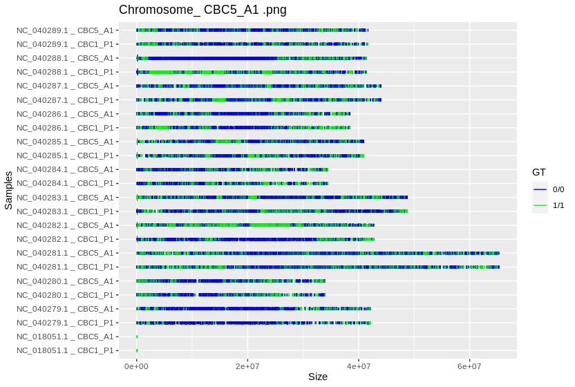

.. GT-Plotting-Tutorial documentation master file, created by
   sphinx-quickstart on Mon Nov 30 17:28:09 2020.
   You can adapt this file completely to your liking, but it should at least
   contain the root `toctree` directive.

GT-Plotting-Tutorial Documentation
==================================

.. toctree::
   :maxdepth: 2
   :caption: Contents:

Background
^^^^^^^^^^

This tutorial plots the genotypic similarities and differences between individuals aligned with to reference genome extracted from a **vcf** file. A ``vcf.gz`` file is used as input, and it outputs ``.png`` files, depicting chromosome number, chromosome position, and genotype. 

.. note::
   
   This is run using Ubuntu 18.04 Bionic Beaver with R version 3.6.0. For different Ubuntu distributions, download and install the appropriate software/packages. 

   Code ran on Linux terminal is preceded by ``$``, while code ran on RStudio is preceded by ``>.``

Step 1 – Installing conda and Setting Up Channels
^^^^^^^^^^^^^^^^^^^^^^^^^^^^^^^^^^^^^^^^^^^^^^^^^

It is recommended to install miniconda3 and create a conda environment to install all necessary packages and dependencies without affecting the system. Miniconda is a free minimal installer for conda. It is a small, bootstrap version of Anaconda that includes only conda, Python, the packages they depend on, and a small number of other useful packages, including pip, zlib and a few others. Use the conda install command to install 720+ additional conda packages from the Anaconda repository.

Open a new terminal **(Ctrl + Alt + T)** and make sure that the system is up-to-date,

:: 

   $ sudo apt-get update

Download the latest package from the '`Miniconda Webpage <https://docs.conda.io/en/latest/miniconda.html>`_ and install it with,

::

   $ curl -O https://repo.anaconda.com/miniconda/Miniconda3-latest-Linux-x86_64.sh
   $ sh Miniconda3-latest-Linux-x86_64.sh

It may be possible that Python 2.7 was installed with miniconda3. In order to use a newer version of Python, install the preferred Python version and update conda to resolve any dependency failures,

::

   $ conda install -c anaconda python=3.7
   $ conda update --all

Setup the appropriate bioconda channels. Make sure to run the following commands exactly in this order,

::

   $ conda config --add channels defaults
   $ conda config --add channels bioconda
   $ conda config --add channels conda-forge

Bioconda is now enabled, so you can install any packages and versions available on the bioconda channel, such as 

::

   $ conda install bwa bowtie bcftools=1.9

Step 2 – Creating a conda environment
^^^^^^^^^^^^^^^^^^^^^^^^^^^^^^^^^^^^^

Create a new conda environment with:

::

   $ conda create --name <environment-name>

Substitute ``<environment-name>`` with the preferred name you want. As an example, 

::

   $ conda create --name R-Data-Science

Once the newly created environment has been installed, activate it with,

::

   $ conda activate R-Data-Science

Step 3 – Installing R and RStudio
^^^^^^^^^^^^^^^^^^^^^^^^^^^^^^^^^

In order to install R and RStudio, it is recommended to run the installation with the use of conda. To install R, input the following,

::

   $ conda install rstudio

By directly installing RStudio, conda will install all the necessary dependencies, including the appropriate version of R. Once the installation is complete, open RStudio in the terminal,

::

   $ rstudio

RStudio will open a new window where R scripts can be run.

Step 4 – Installing and Loading the Necessary R Packages
^^^^^^^^^^^^^^^^^^^^^^^^^^^^^^^^^^^^^^^^^^^^^^^^^^^^^^^^

In RStudio, create a new R script and begin developing it by going to **File>New File>R Script**. In order to open the genome ``vcf.gz`` files, ``unzip`` and ``tar`` are required. The system might have multiple directories containing ``unzip`` and ``tar``. 

::

   > getOption("unzip")
   > options(unzip = "/usr/bin/unzip")
   >
   > Sys.getenv("TAR")
   > Sys.setenv(TAR = "/bin/tar")

First install and load ``devtools``, which will help install the corresponding dependencies and GitHub libraries later on,

::

   > install.packages(“devtools”)
   > library(devtools)

Install the necessary dependencies using `BiocManager <https://cran.r-project.org/web/packages/BiocManager/vignettes/BiocManager.html>`_,

::

   > BiocManager::install(c("VariantAnnotation"))

If the above did not run, it may be needed to install first `BiocManager <https://cran.r-project.org/web/packages/BiocManager/vignettes/BiocManager.html>`_ and then run the above again,

::

   > install.packages("BiocManager")

Install the libraries `vcfR <https://github.com/knausb/vcfR>`_ and `GT-Plotting <https://github.com/AnzaGhaffar/GT-Plotting>`_ from their respective GitHub repositories, 

::

   > devtools::install_github("knausb/vcfR")
   > devtools::install_github("AnzaGhaffar/GT-Plotting")

Load the installed dependencies and GitHub libraries,

::

   > library(tidyr)
   > library(ggplot2)
   > library("VariantAnnotation")
   > library("vcfR")
   > library("GTPlotting")

Step 5 – Pointing towards the vcf File
^^^^^^^^^^^^^^^^^^^^^^^^^^^^^^^^^^^^^^

RStudio will need to know where the **vcf** file is. Specify the path and filename, 

::

   > path <- "/path/to/directory/with/vcf/file/"
   > setwd(path)
   > vcffilename <- "name_of_vcf_file.vcf.gz"

The next three steps consist of running functions to plot the genotypes.

Step 6 – VcfToTable Function
^^^^^^^^^^^^^^^^^^^^^^^^^^^^

``VcfToTable`` takes as input a **vcf** file with extension ``.vcf`` or ``.vcf.gz`` and creates an object that consists of two data frames,

::

   > vcf_testdata<-VcfToTable(vcffilename)

Then, the important features are extracted from the **vcf** file for the genotype plotting using the ``vcfdata`` data frame,

::

   > vcf_testdata$vcfdata

Running the above will output the CHROM, POS, REF, ALT, QUAL, INDVL1, and INDVL2. A data frame is created by running,

::
   
   > vcf_testdata$chromelen

The output looks like below with chromosome number and size, 

::

       chromosome   size
   1  NC_018051.1     16
   2  NC_040279.1  38450
   3  NC_040280.1  34390
   4  NC_040281.1  54830
   5  NC_040282.1 193987
   6  NC_040283.1 125079
   7  NC_040284.1  36664
   8  NC_040285.1 104691
   9  NC_040286.1  58685
   10 NC_040287.1  83639
   11 NC_040288.1 276550
   12 NC_040289.1  52588

Step 7 – GTPlotting_Chromosome Function
^^^^^^^^^^^^^^^^^^^^^^^^^^^^^^^^^^^^^^^

This function plots the genotype of each chromosome. It takes three inputs the **vcf** data frame generated by the ``VcfToTable`` function, the chromosome length table generated by the ``VcfToTable`` function, and the name of the control sample should be same as in the **vcf** file,

::

   > GTPlotting_Chromosome(vcf_testdata$vcfdata,vcf_testdata$chromelen,'Grinkan_CTRL')

.. figure:: ../images/function_02_output.jpeg
   :width: 600px
   :align: center
   :figclass: align-center

   **Figure 1.** "GTPlotting_Chromosome" output. (click to expand)

Step 8 – GTPlotting_Chromosome_Combined Function
^^^^^^^^^^^^^^^^^^^^^^^^^^^^^^^^^^^^^^^^^^^^^^^^

This function plots the genotype of all the chromosomes. It takes two inputs the **vcf** data frame generated by the ``VcfToTable`` function and the chromosome length table generated by the ``VcfToTable`` function,

::

   > GTPlotting_Chromosome_Combined(vcf_testdata$vcfdata,vcf_testdata$chromelen)

   **Figure 2.** "GTPlotting_Chromosome_Combined" output. (click to expand)
